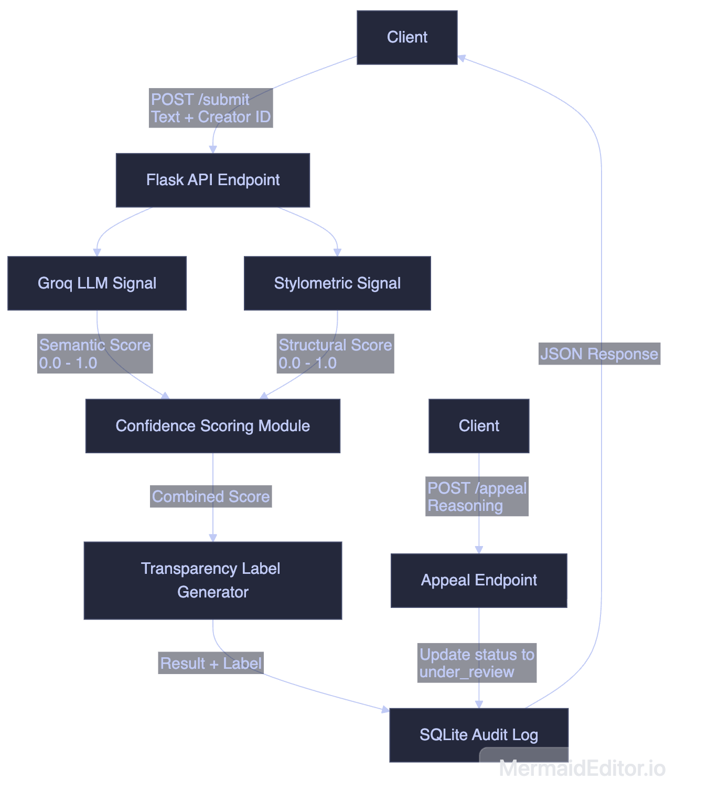

# Provenance Guard

Provenance Guard is a backend system designed for creative sharing platforms to classify submitted content, score confidence, surface a transparency label to users, and handle appeals from creators who believe they've been misclassified.

## Architecture Overview
The path a submission takes from input to transparency label:
1. **Submission:** A creator submits a piece of content (text) and their ID to the `POST /submit` endpoint.
2. **Analysis:** The text is run through two distinct detection signals concurrently: Groq LLM (semantic) and Stylometric heuristics (structural).
3. **Scoring:** The outputs from both signals are passed into a scoring module, which calculates a unified confidence score between 0 and 1.
4. **Labeling:** Based on the confidence score, the system selects one of three transparency labels (Human, Uncertain, AI) that best represents the system's attribution confidence.
5. **Logging:** The entire event, including raw signal scores, final confidence score, and the label, is saved to an SQLite Audit Log database.
6. **Response:** The system returns the classification result and the transparency label to the client.
7. **Appeals:** If contested, the creator submits an appeal via `POST /appeal`. The system updates the DB status to `under_review` and logs the creator's reasoning for manual review.



## Detection Signals
The detection pipeline uses at least 2 distinct signals to classify content:

1. **Signal 1: Groq LLM Classifier (`llama-3.3-70b-versatile`)**
   - **Measures:** Semantic coherence, stylistic flow, and contextual anomalies typical of LLMs (e.g., words like "delve," "tapestry").
   - **Why Chosen:** LLMs are highly effective at detecting the distinctive "voice" and tone of other LLM generations.
   - **What it misses (Blind Spot):** Vulnerable to prompt-injected "human-like" variations, such as deliberate typos, slang, or prompt instructions to "write informally."

2. **Signal 2: Stylometric Heuristics**
   - **Measures:** Sentence length variance and type-token ratio (vocabulary diversity). 
   - **Why Chosen:** AI-generated text often exhibits highly uniform sentence structures and lower vocabulary diversity compared to humans. It provides a pure mathematical, structural counter-balance to the semantic LLM signal.
   - **What it misses (Blind Spot):** Formulaic or highly structured human writing (like technical manuals, legal text, or simple poetry with repetition) might exhibit low variance, leading to false positives.

## Confidence Scoring
The final confidence score is an unweighted average of the two signals: `(Groq Score + Stylometric Score) / 2`.
This ensures that both semantic markers and structural anomalies are required to achieve a high confidence score. I validated that it is meaningful by passing diverse texts—poetry, conversational text, and heavily academic/AI-sounding text—and checking if the combined score reliably maps to the right label.

**Examples showing meaningful score variance:**

- **Low-confidence (Likely Human):**
  - **Input:** *"The sun dipped below the horizon, painting the sky in hues of amber and rose. I sat on the porch, coffee in hand, watching the neighborhood slowly go quiet."*
  - **Scores:** Groq: `0.10`, Stylo: `0.584` -> **Confidence: `0.342`** (Likely Human)

- **High-confidence (Likely AI):**
  - **Input:** *"Delve into the multifaceted tapestry of artificial intelligence. It is a paradigm shift. It is a transformative force. We must explore the ethical implications. We must collaborate. The tapestry of technology is complex. Delve into the tapestry."*
  - **Scores:** Groq: `0.95`, Stylo: `0.667` -> **Confidence: `0.809`** (Likely AI)

## Transparency Label
The transparency labels that surface to the end-user are explicitly tied to the confidence score thresholds:

| Result | Threshold | Label Text |
|--------|-----------|------------|
| **High-Confidence Human** | `< 0.40` | "High-confidence human: This content exhibits natural stylistic variations and structures typical of human writing." |
| **Uncertain** | `0.40 - 0.70` | "Uncertain: This content exhibits mixed signals. We cannot confidently determine if it is human-written or AI-generated." |
| **High-Confidence AI** | `> 0.70` | "High-confidence AI: This content exhibits strong structural and semantic patterns typical of AI generation." |

## Rate Limiting
- **Limit:** `10 per minute; 100 per day` per IP address.
- **Reasoning:** A single creator legitimately uploading new chapters, poems, or blog posts is extremely unlikely to exceed 10 submissions a minute or 100 a day. However, a malicious bot attempting to flood the system with generated content to scrape the thresholds or overwhelm the DB will quickly be rate limited. 

**Proof of Rate Limiting Execution (Bash 12 requests):**
```
200
200
200
200
200
200
200
429
429
429
429
429
```

## Audit Log
Here is an excerpt of 3 entries from the `GET /log` endpoint showing human, AI, and an appealed submission:
```json
[
  {
      "attribution": "likely_ai",
      "confidence": 0.80857,
      "content_id": "d8f3ea79-7eb0-4f84-b02e-02ceff4d2e31",
      "creator_id": "test-user-3",
      "creator_reasoning": "I am a tapestry maker and wrote this about my craft.",
      "groq_score": 0.95,
      "status": "under_review",
      "stylo_score": 0.66714,
      "timestamp": "2026-07-01T15:41:30.780307Z"
  },
  {
      "attribution": "uncertain",
      "confidence": 0.58129,
      "content_id": "ff900185-d9c5-468e-9afe-ef4136431e75",
      "creator_id": "test-user-2",
      "creator_reasoning": null,
      "groq_score": 0.9,
      "status": "classified",
      "stylo_score": 0.26258,
      "timestamp": "2026-07-01T15:41:19.330167Z"
  },
  {
      "attribution": "likely_human",
      "confidence": 0.34185,
      "content_id": "cb846d9b-fb3c-44f2-90c5-acce70fe494b",
      "creator_id": "test-user-1",
      "creator_reasoning": null,
      "groq_score": 0.1,
      "status": "classified",
      "stylo_score": 0.58370,
      "timestamp": "2026-07-01T15:41:12.114913Z"
  }
]
```

## Known Limitations
**Technical/Legal Documentation:** A human writing a highly structured privacy policy or software documentation. The stylometric signal will likely score it very close to `1.0` due to low sentence length variance and repeated vocabulary. If Groq also finds it formulaic, it might trigger a false positive "Likely AI." Our system is designed for a creative writing platform, so it performs best on unstructured narrative or poetry.

## Spec Reflection
- **How the spec helped:** Having the exact JSON structure of the audit log in the spec made building `database.py` very fast. There was no ambiguity on what fields needed to be stored or returned in the `GET /log` endpoint. 
- **Where we diverged:** I initially planned for the stylometric variance score to just measure raw variance. However, I realized in the implementation phase that I needed to cap and normalize the variance to fit perfectly between `0.0` and `1.0` so it could be easily averaged with the Groq score.

## AI Usage Section
1. **Flask Scaffold Generation:** I prompted an AI assistant with the `planning.md` architecture to build the base Flask skeleton. I revised the generated output because it used an older version of `flask-limiter` syntax. I updated the rate limit configuration to properly use `storage_uri="memory://"`.
2. **Stylometric Heuristic Optimization:** I requested the AI to generate a function for sentence length variance and type-token ratio. I revised the logic to ensure we explicitly strip out punctuation before splitting by sentence structure, as the AI generated regex missed consecutive punctuations (like `...` or `?!`). I also hand-tuned the `max_variance` cap (set to 50.0) based on local testing.
